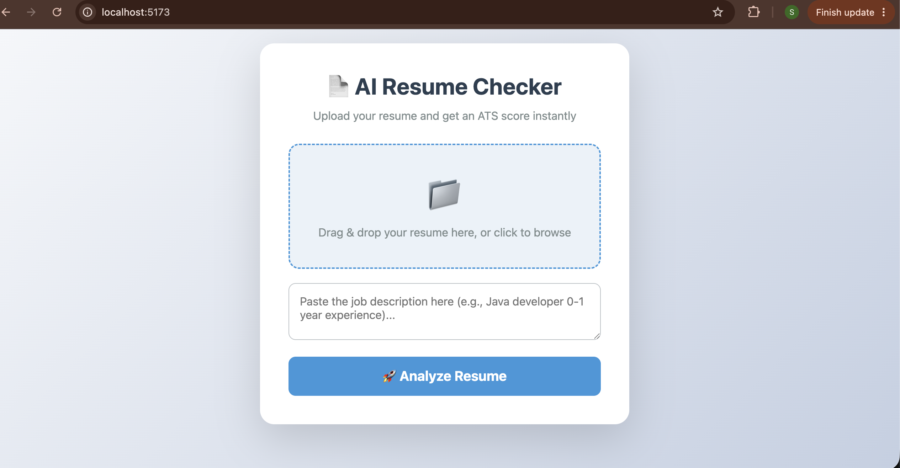

<<<<<<< HEAD
# 🧠 AI Resume Checker (ATS Analyzer)

> A full-stack, offline-first AI application that analyzes your resume against job descriptions, provides an ATS match score, and suggests improvements.

---

## 📸 Demo Screenshot

*(You can drag and drop a screenshot of your app into this folder, name it `demo.png`, and replace the placeholder below)*


---

## 🚀 Tech Stack

| Layer | Technology |
| :--- | :--- |
| **Frontend** | React (Vite), Pure CSS |
| **Backend** | FastAPI (Python) |
| **Database & Auth** | Supabase (PostgreSQL + Storage + Google OAuth) |
| **AI Engine** | Ollama (100% offline LLM running locally) |
| **Authentication** | Google Sign-In via Supabase Auth |

---

## ✨ Features

- ✅ **Drag & Drop Upload** – Upload PDF/DOCX resumes effortlessly
- ✅ **Job Description Matching** – Paste any JD and get instant insights
- ✅ **ATS Score (0–100%)** – AI-powered match score based on keyword density and relevance
- ✅ **Keyword Analysis** – See exactly which keywords are missing vs. matched
- ✅ **Formatting Issues** – Detect structure and layout problems in your resume
- ✅ **Actionable Suggestions** – Get 3–5 specific tips to improve your resume
- ✅ **Google OAuth Login** – Secure sign-in using your Google account
- ✅ **Persistent History** – All scans are saved in Supabase (user-specific)

---

## 🛠️ Local Setup Guide

### 1. Clone the repository

```bash
git clone https://github.com/YOUR_USERNAME/ai-resume-checker.git
cd ai-resume-checker


2. Set up the Backend
bash
cd backend
python3 -m venv venv
source venv/bin/activate
pip install -r requirements.txt
Create a .env file in the backend/ directory and add:

text
SUPABASE_URL=your_supabase_url
SUPABASE_ANON_KEY=your_anon_key
SUPABASE_SERVICE_ROLE_KEY=your_service_role_key
SUPABASE_JWT_SECRET=your_jwt_secret
ALLOWED_ORIGINS=http://localhost:5173,http://localhost:8000
Then run the server:

bash
uvicorn app.main:app --reload --host 0.0.0.0 --port 8000
3. Set up the Frontend
bash
cd ../frontend
npm install
npm run dev
4. Run Ollama (Offline AI)
Make sure you have Ollama installed on your Mac, then:

bash
ollama pull llama3.2
ollama serve
🌐 Access the App
Open your browser and go to:

text
http://localhost:5173
📂 Project Structure
text
resume-checker/
├── backend/               # FastAPI backend
│   ├── app/               # Main application logic
│   ├── .env               # Environment variables
│   └── requirements.txt   # Python dependencies
├── frontend/              # React frontend
│   ├── src/               # Source code
│   └── package.json       # Node dependencies
├── README.md              # Project documentation
└── LICENSE                # MIT License


🧠 Developer
Built with ❤️ by [Suraj Dev Yadav]
=======
# 🧠 AI Resume Checker (ATS Analyzer)

> A full-stack, offline-first AI application that analyzes your resume against job descriptions, provides an ATS match score, and suggests improvements.

---

## 📸 Demo Screenshot

*(You can drag and drop a screenshot of your app into this folder, name it `demo.png`, and replace the placeholder below)*


---

## 🚀 Tech Stack

| Layer | Technology |
| :--- | :--- |
| **Frontend** | React (Vite), Pure CSS |
| **Backend** | FastAPI (Python) |
| **Database & Auth** | Supabase (PostgreSQL + Storage + Google OAuth) |
| **AI Engine** | Ollama (100% offline LLM running locally) |
| **Authentication** | Google Sign-In via Supabase Auth |

---

## ✨ Features

- ✅ **Drag & Drop Upload** – Upload PDF/DOCX resumes effortlessly
- ✅ **Job Description Matching** – Paste any JD and get instant insights
- ✅ **ATS Score (0–100%)** – AI-powered match score based on keyword density and relevance
- ✅ **Keyword Analysis** – See exactly which keywords are missing vs. matched
- ✅ **Formatting Issues** – Detect structure and layout problems in your resume
- ✅ **Actionable Suggestions** – Get 3–5 specific tips to improve your resume
- ✅ **Google OAuth Login** – Secure sign-in using your Google account
- ✅ **Persistent History** – All scans are saved in Supabase (user-specific)

---

## 🛠️ Local Setup Guide

### 1. Clone the repository

```bash
git clone https://github.com/suraj662/resume-checker.git
cd resume-checker


2. Set up the Backend
bash
cd backend
python3 -m venv venv
source venv/bin/activate
pip install -r requirements.txt


Create a .env file in the backend/ directory and add:
SUPABASE_URL=your_supabase_url
SUPABASE_ANON_KEY=your_anon_key
SUPABASE_SERVICE_ROLE_KEY=your_service_role_key
SUPABASE_JWT_SECRET=your_jwt_secret
ALLOWED_ORIGINS=http://localhost:5173,http://localhost:8000
Then run the server:

bash
uvicorn app.main:app --reload --host 0.0.0.0 --port 8000

3. Set up the Frontend
bash
cd ../frontend
npm install
npm run dev

4. Run Ollama (Offline AI)
Make sure you have Ollama installed on your Mac, then:

bash
ollama pull llama3.2
ollama serve


🌐 Access the App
Open your browser and go to:
http://localhost:5173


📂 Project Structure
text
resume-checker/
├── backend/               # FastAPI backend
│   ├── app/               # Main application logic
│   ├── .env               # Environment variables
│   └── requirements.txt   # Python dependencies
├── frontend/              # React frontend
│   ├── src/               # Source code
│   └── package.json       # Node dependencies
├── README.md              # Project documentation
└── LICENSE                # MIT License


🧠 Developer
Built by Suraj Dev Yadav
>>>>>>> 81b338caad2fb0a44791da982bf2e77b47023df5
